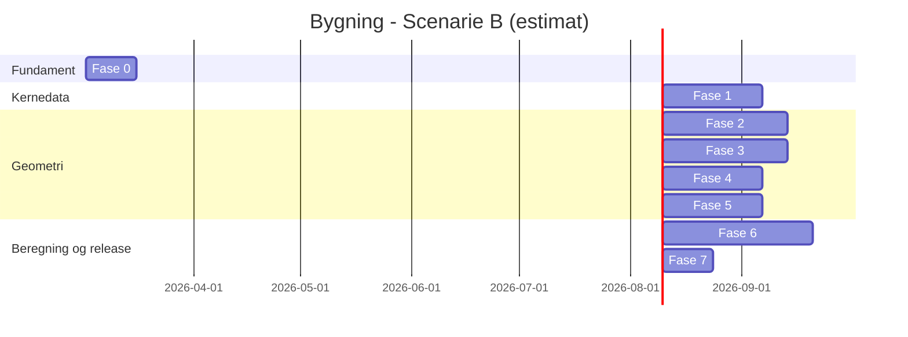

# Bygning – produktionsfaseplan (DK)

## 1) Kan det bygges?
Ja – projektet kan bygges. Omfanget er stort, men teknisk realistisk med en faseopdelt leverance, tydelig afgrænsning af MVP, og en streng kvalitetssikringsproces.

**Vigtig afgrænsning:**
- Beregninger og output skal tydeligt mærkes som **forprojektering/indikative** og kræver eftervisning af rådgivende ingeniør før udførelse.
- Beregningsmotor skal baseres på dokumenterede metoder (Eurocodes/DS/NA, BR18-referencer), og alle formler skal versionsstyres med kildereferencer.

---

## 2) Tre løsningsscenarier (du vælger retning)

## Scenarie A – Hurtig MVP (lav risiko, hurtig værdi)
**Mål:** Fase 1–3 + simpel 2D-placering, men uden fuld 3D/facade+gavl-flow.

**Indhold:**
- Kunde/projektoprettelse + e-mail verifikation.
- Adresseopslag og matrikelvisning (kortintegration).
- 2D skitseværktøj til bygningsaftryk og arbejdsområde.
- Materialebibliotek v1 (30 elementer) + første lastoverslag (linjelast, ikke fuld punktlastpipeline).

**Estimat:** 10–14 uger.

## Scenarie B – Balanceret produktforløb (anbefalet)
**Mål:** Fase 1–6 i robust version med audit trail og kontroller.

**Indhold:**
- Alt i Scenarie A.
- Gavl/facade-tegning og lastlinjer i 2.5D-flow.
- Linjelaster + punktlaster (for intern/pro-brug) med versionsstyret beregningskerne.
- Rapportgenerator med kildehenvisninger pr. formel.
- Rollemodel (kunde, rådgiver, admin) og events/logning.

**Estimat:** 20–28 uger.

## Scenarie C – Ambitiøs platform (enterprise)
**Mål:** Fuld platform med avanceret geometri, samarbejde og API-integrationer.

**Indhold:**
- Alt i Scenarie B.
- Avanceret geometri-motor, konfliktdetektion, multi-bruger samarbejde i realtid.
- Integrationer (GIS/BBR/CRM), avanceret rettighedsstyring, BI dashboards.

**Estimat:** 9–14 måneder.

---

## 3) Anbefaling
**Anbefalet: Scenarie B (Balanceret).**

### 3 gode begrundelser
1. Giver forretningsværdi tidligt men uden at kompromittere den tekniske kvalitet.
2. Omfatter hele din ønskede faglige kæde (fra projektdata til lastberegning og rapport).
3. Realistisk at kvalitetssikre med dokumenterbare kontrolpunkter i hver fase.

### 3 dårlige begrundelser (ting du skal acceptere)
1. Længere time-to-market end en ren MVP.
2. Højere initial investering i arkitektur og kvalitetssikring.
3. Flere afhængigheder (kortdata, e-mail, beregningskilder) giver større koordinationsbehov.

---

## 4) Produktionsplan med delmål, gates og involvering

## Fase 0 – Fundament og governance (uge 1–2)
**Leverancer:**
- Arkitekturdiagram (frontend, backend, beregningskerne, data-lag).
- Standard for kildehenvisning af formler.
- Sikkerhedsbaseline (auth, kryptering, audit logging, backup).

**Kvalitetsgate (G0):**
- Trusselsmodel godkendt.
- CI/CD, teststandarder og kodekonvention på plads.

**Din involvering:**
- Godkende scenarievalg, succeskriterier og risikotolerance.

## Fase 1 – Kunde/projekt og sikker adgang (uge 3–6)
**Leverancer:**
- Oprettelse: kundenavn, kontaktoplysninger, projektdata.
- “Projektadresse = kundeadresse” checkbox.
- E-mail + engangskode (OTP) login/verifikation.

**Kvalitetsgate (G1):**
- 0 kritiske sikkerhedsfund.
- 95%+ testpass på domænelogik.

**Din involvering:**
- Godkende datafelter, UX-flow og juridiske tekster (samtykke/ansvar).

## Fase 2 – Matrikel og 2D placering (uge 7–11)
**Leverancer:**
- Kortvisning af projektadresse.
- Arbejdsområde (tegnezone) på matrikel.
- Polyline/polygon-værktøjer: hus, anneks, tilbygning, skur, carport, terrasse.

**Kvalitetsgate (G2):**
- Geometri-validering: lukkede polygoner, ingen selvkryds.
- Koordinat-transformation testet.

**Din involvering:**
- Godkende tegneværktøj og brugerflow i praksis.

## Fase 3 – Bygningsinformation og materialer (uge 12–16)
**Leverancer:**
- Materialebibliotek v1 (min. 30 elementer).
- Konstruktionstyper: vægge, gulve, tag, skillevægge m.fl.
- Inputvalidering med intervalkontroller.

**Kvalitetsgate (G3):**
- Alle materialeparametre har kilde/standardreference.
- Enhedskonsistens (kN, kN/m², mm, m) verificeret.

**Din involvering:**
- Prioritere standardopbygninger og defaults.

## Fase 4 – Facader/gavle workflow (uge 17–20)
**Leverancer:**
- Markér 2 parallelle linjer -> skift til gavlvisning.
- Tegn gavlprofil og spejl til modsat ende.
- Forbind med facadeflader; understøt ekstra gavle/udbygninger.

**Kvalitetsgate (G4):**
- Topologitests for sammenhængende geometri.
- UI-test for alle centrale brugerrejser.

**Din involvering:**
- Godkende om faglogikken for gavle/facader matcher praksis.

## Fase 5 – Lastlinjer (uge 21–24)
**Leverancer:**
- Interaktiv indtegning af lastlinjer i gavl/facade-snit.
- Projektion gennem bygningsmodel til modstående flader/knudepunkter.
- Konfliktdetektion ved krydsende/afbrudte linjer.

**Kvalitetsgate (G5):**
- Deterministiske resultater for samme input.
- Geometrisk konsistens testet på referencecases.

**Din involvering:**
- Godkende 8–12 referenceprojekter som “sandhedssæt”.

## Fase 6 – Beregningsmotor (uge 25–30)
**Leverancer:**
- Areallaster -> linjelaster -> punktlaster.
- Lastretninger (x, y, z-, z+) og kombinationer efter valgt standardprofil.
- Rapportudtræk med sporbarhed: input, formler, delresultater.

**Kvalitetsgate (G6):**
- Formeltests mod håndregnede cases.
- Regressionstest + versionsmærkning af beregningskerne.

**Din involvering:**
- Godkende rapportformat og kommerciel split (kundevisning vs intern punktlastvisning).

## Fase 7 – Drift, monitorering, release (uge 31–32)
**Leverancer:**
- Logning, alarmer, backup/restore, incident-runbook.
- Udrulning (staging -> produktion), supportflow.

**Kvalitetsgate (G7):**
- Performance/SLA-mål opfyldt.
- Go-live review og rollback plan godkendt.

**Din involvering:**
- Endelig go/no-go beslutning.

---

## 5) Kvalitetssikring: “kontrol på kontrol”

### Kontrolniveauer
1. **Inputkontrol:** obligatoriske felter, intervalgrænser, enhedstjek.
2. **Domænekontrol:** regler for geometri, lastlinjer og materialekombinationer.
3. **Beregningskontrol:** referencecases + tolerancer + regression.
4. **Sikkerhedskontrol:** auth, OTP, rate limiting, revisionsspor.
5. **Driftskontrol:** monitorering, alarmer, fejlsøgning og postmortems.

### Krav for at gå videre mellem faser
- Ingen åbne kritiske fejl.
- Alle definerede testcases passerer.
- Dokumentation er opdateret.
- Gate-signoff (dig + udvikling).

---

## 6) Forslag til minimalistisk teknisk stack
- **Frontend:** React + TypeScript + map-komponent + simpel, funktionel UI.
- **Backend:** Node.js/TypeScript (eller .NET) med modulær domænestruktur.
- **Database:** PostgreSQL + PostGIS til geometri.
- **Auth:** e-mail OTP + sessionsstyring + audit log.
- **Beregning:** isoleret “calculation engine” modul med versionsnummer.
- **Kvalitet:** CI med unit/integration/e2e + statisk analyse + sikkerhedsscanning.

---

## 7) Gantt-lignende plan (Scenarie B)

---

## 8) Hvornår du skal inddrages (kort)
- **Uge 1–2:** Scenarievalg + acceptkriterier.
- **Uge 5–6:** Godkendelse af onboarding/login flow.
- **Uge 10–11:** Godkendelse af tegneværktøj.
- **Uge 15–16:** Godkendelse af materialebibliotek v1.
- **Uge 20:** Godkendelse af gavl/facade workflow.
- **Uge 24:** Godkendelse af lastlinjehåndtering.
- **Uge 30:** Godkendelse af beregningsrapporter.
- **Uge 32:** Go-live beslutning.

---

## 9) Næste konkrete step
1. Du vælger **A, B eller C**.
2. Jeg omsætter valget til en detaljeret backlog (epics, user stories, acceptkriterier).
3. Vi låser “Definition of Done” og starter Fase 0.

---

## 10) Kommunikations- og godkendelsesflow (Plan B)
For hver fasegate sender systemet en godkendelsesmail til:
- **Modtager:** `ja40559646@gmail.com`
- **Emneformat:** `Godkendelse af fase XX`
- **Indhold (minimum):**
  - Fase-ID (fx Fase 2 / Gate G2)
  - Hvad der er leveret
  - Teststatus og kendte risici
  - Link til godkendelsesside og deadline

### Implementeringskrav for mailflow
1. SMTP/transactional e-mail provider (fx SendGrid, Mailgun eller Microsoft 365 SMTP).
2. Verificeret afsenderdomæne (SPF, DKIM, DMARC).
3. Retry + dead-letter håndtering ved mailfejl.
4. Audit-log for afsendt mail (tid, modtager, fase, status).

> Bemærk: Selve produktet kan sende disse mails automatisk, men notifikationerne kræver at mail-integration og credentials er opsat i miljøet.

---

## 11) GitHub-adgang (hvad der skal etableres)
For at arbejde direkte mod dit GitHub-repo kræves normalt:
1. Repository remote sat op i dette miljø.
2. Push-rettigheder (PAT eller GitHub App token med `repo`-scope).
3. Valgfrit: CI secrets til test/deploy pipelines.

Hvis du vil, kan jeg i næste step lave en kort **setup-checkliste** til dig (5 minutter), så du kan bekræfte adgang på én gang.
